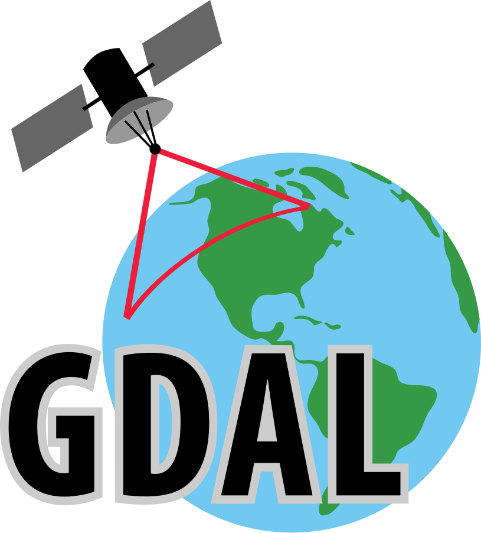
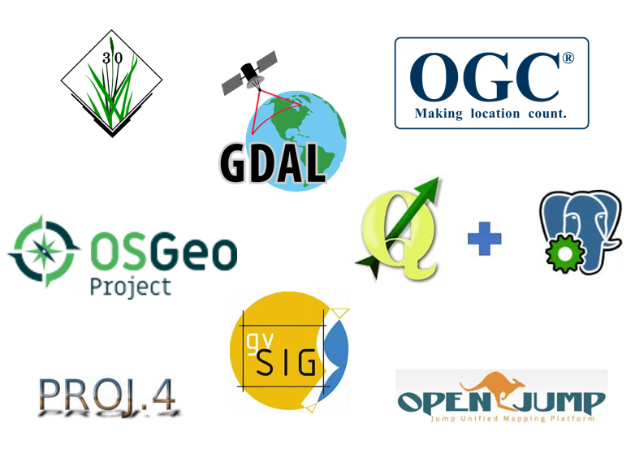

# geo-dev-resources
### Latest &amp; Greatest developments in geospatial technology for Engineers and Spatial Data Scientists

  
  &nbsp&nbsp&nbsp&nbsp&nbsp&nbsp&nbsp&nbsp
  

A space to collaborate on new libraries and technologies mostly related to the python geospatial ecosystem   
Notebooks with working examples from each library or project   
Links to Libraries, Platforms &amp; People relvant to spatial tech    
Focus on FOSS4G and Open Source, though throwing in a few proprietary examples you might find of use  

This resource is open to contributions from all!   
Please feel free to make a PR and add anything interesting or something that was missed  

#### Libraries/Projects
- [GeoParquet](https://geoparquet.org/)
- [Polars](https://pola.rs/)
- [DuckDB](https://duckdb.org/)
- [Lonboard](https://github.com/developmentseed/lonboard)
- [Leafmap](https://leafmap.org/)
- [GeoArrow](https://geoarrow.org/)
- [pydeck](https://deckgl.readthedocs.io/en/latest/)
- [Docker](https://www.docker.com/)
- [STAC](https://stacspec.org/en)
- [xarray](https://docs.xarray.dev/en/stable/)
- [Datashader](https://datashader.org/)
- [PostGIS](https://postgis.net/)

#### Platforms/Utilities
- [Fused](https://www.fused.io/)
- [Overture Maps](https://overturemaps.org/)
- [Whereobots](https://wherobots.com/)
- [Source Cooperative](https://source.coop/)
- [Protomaps](https://protomaps.com/)
- [Apache Sedona](https://sedona.apache.org/latest/)
-  

#### Tools/Random 
- [VSCode Geo Data Viewer Ext.](https://marketplace.visualstudio.com/items?itemName=RandomFractalsInc.geo-data-viewer)
- [Jupinium.nvim](https://github.com/kiyoon/jupynium.nvim)
